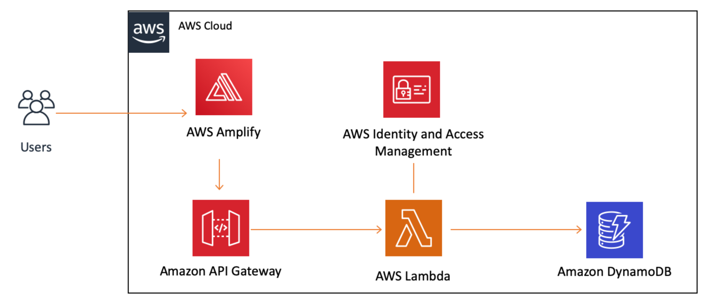
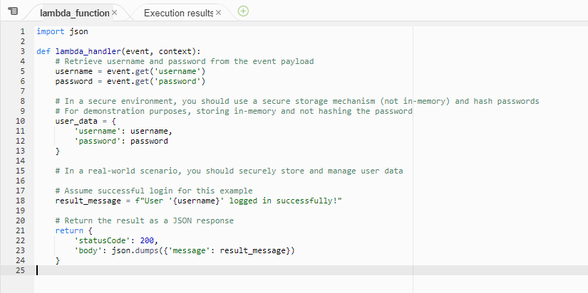
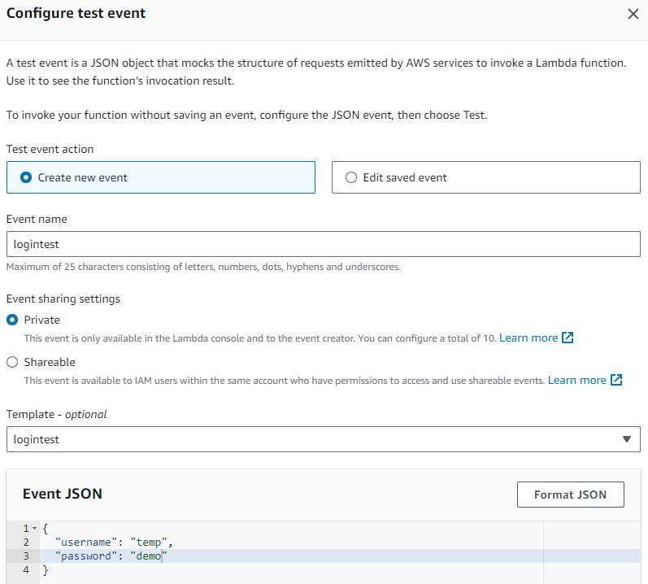
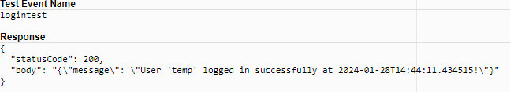
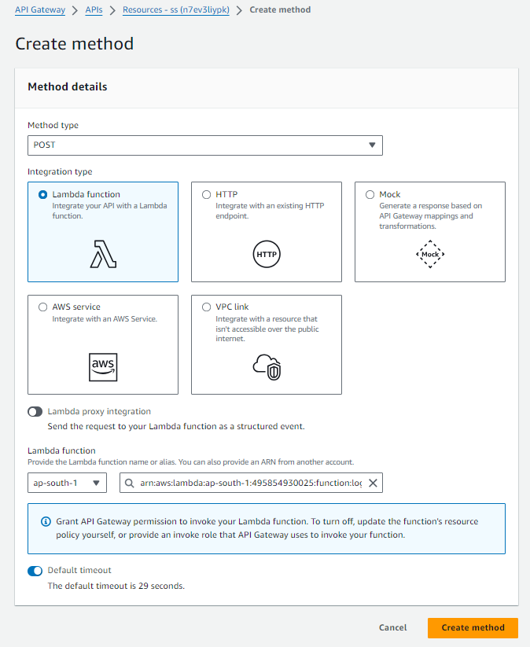
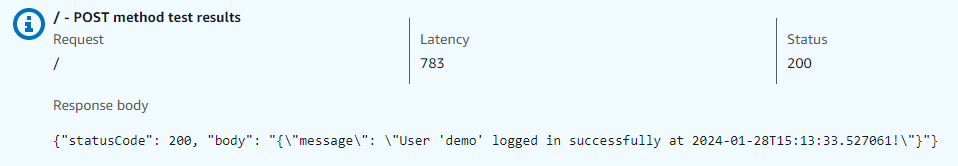
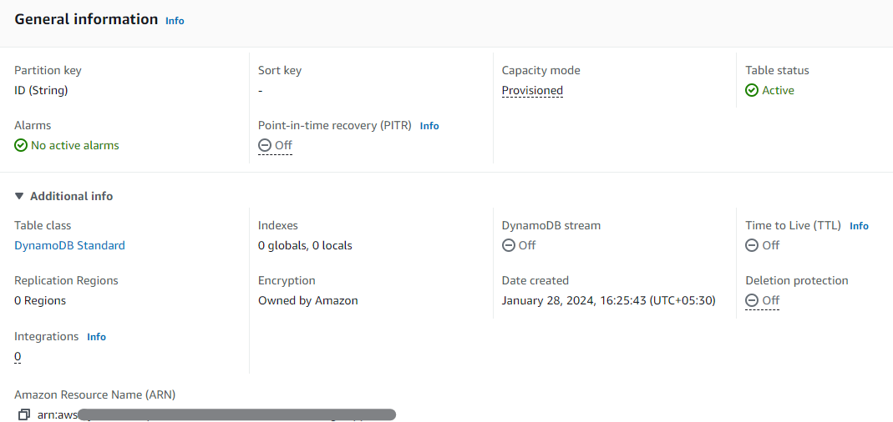

# Simple Login app (Serverless) Aws web application

### Aim:

* To create a Simple login web application in the AWS infrastructure. The user's credentials will be captured using an API and stored in a database.

### What you will accomplish:
* Create a web app.
* Connect the web app to a serverless backend.
* Add interactivity to your web app with an API and a database.


### Services used:
1. AWS Amplify
2. AWS Lambda
3. Amazon API Gateway
4. Amazon DynamoDB
5. AWS Identity and Access Management (IAM)

### Architecture



## Steps :
## 1. Web app with Amplify Console:
* Create a simple html website and put it in a zipped folder. ***(use test_index.html)***
* Log into the Amplify console and click on Get Started.
* Select Host web app. Now you have various options to install your HTML code in the AWS Amplify. I used "Deploy without GiT provider"
* In the App name field, enter your desired app name. For the Environment name, enter dev.
* Drag and drop your zipped file and choose Save and Deploy.
* After a few seconds, you should see the message Deployment completed.


### Testing  
* Select Domain Management in the left navigation menu.
* Copy and paste the URL displayed in the form into your browser.

Your web app will load in a new browser tab. Congratulations!

#### Note: If you have already purchased a domain you can associate it with this website through Domain management and also implement an SSL certificate automatically.  


## 2. Build a serverless function with Lambda:

* In a new browser tab, log in to the AWS Lambda console.

* Choose the orange Create function button.
* Under the Function name, enter the desired function name.
* Select the latest Python version from the runtime dropdown and leave the rest of the defaults unchanged. Create function.
*  Under Code source, replace the code provided with the following:
***(use Test_lambda_function.py)***



* Save by going to the file menu and selecting Save to save the changes and hit deploy.
*  Let's test our new function. Choose the orange Test button to create a test event by selecting Configure test event.
* Pass the necessary arguments 
```json
{
    "username" : "demo",
    "password" : "demo123"
}
``` 
 



* You should see a light green box at the top of the page with the following text: Execution result: succeeded. You can choose Details to see the event the function returned.
  



## 3. Link a serverless function to the web app (AWS API gateway)


* In the Choose an API type section, find the REST API card and choose the Build button on the card.
* From the Actions dropdown menu, select Create Method.
* Select POST from the new dropdown that appears, then select the checkmark. Select Lambda Function for the Integration type.
* Select your appropriate region and your lambda function in the Arn section


* With the newly created POST method selected, select Enable CORS from the Action dropdown menu.
* Leave the POST checkbox selected choose Enable CORS and replace the existing CORS headers button.
#### Note: CORS – The CORS browser security feature uses HTTP headers to tell a browser to allow a given web application running at one origin (domain) to access selected resources from a server at a different origin.

* You can test and validate your API.
* You should see a response with Code 200.




## 4. Create a Database table (Amazon Dynamodb)

* Login to the Amazon DynamoDB console. Select the Create Table button.
* Under the Table name, enter the desired name.
* In the Partition key field, enter ID. The partition key is part of the table's primary key.
* Leave the rest of the default values unchanged and choose the Create Table button.
* In the General Information section, show Additional info by selecting the down arrow.
9. Copy the Amazon Resource Name (ARN). You will need it later in this module.


#### Table permissions
Now that we have a table, let's edit our Lambda function to be able to write data to it.   
We'll be adding permissions to our function so it can use the DynamoDB service, and we will be using AWS Identity and Access Management (IAM) to do so.
* In a new browser window, open the AWS Lambda console. Select the function we created earlier. 
* Select the Configuration tab and select Permissions from the right-side menu.
* In the Execution role box, under Role name, choose the link. A new browser tab will open.
* In the Permissions policies box, open the Add permissions dropdown and select Create inline policy.
* Select the JSON tab. Paste the following policy in the text area, taking care to replace your table's ARN in the Resource field in line 15:
```json
{
	"Version": "2012-10-17",
	"Statement": [
		{
			"Sid": "VisualEditor0",
			"Effect": "Allow",
			"Action": [
				"dynamodb:PutItem",
				"dynamodb:DeleteItem",
				"dynamodb:GetItem",
				"dynamodb:Scan",
				"dynamodb:Query",
				"dynamodb:UpdateItem"
			],
			"Resource": "<your ARN here>"
		}
	]
}
```
This policy will allow our Lambda function to read, edit, or delete items, but restrict it to only be able to do so in the table we created.

* Create this policy defining an appropriate name and apply

#### Modify Lambda function to write o Dynamodb table:

* Replace the code within the lambda function and test the changes ***(use lambda_function.py file)***.
* Select the Test button.
You should see an Execution result: succeeded message with a green background.
* In a new browser tab, open the DynamoDB console. In the left-hand navigation pane, select Tables > Explore items.
* Select your table, which we created earlier, then select the Items tab on the right.  
##### Items matching your test event appear under Items returned. Every time your Lambda function executes, your DynamoDB table will be updated. If the same name is used, only the time stamp will change.

## 5. Add Interactivity to Your Web App

Open the index.html file you created in step 1.  
* Replace the existing code.* **(use index.html file)***
* Make sure you add your API Invoke URL (from Step 4). 
#### Note: If you do not have your API's URL, you can get it from the API Gateway console by selecting your API and choosing stages.
* Re-upload this file and let it deploy. 

#### Test the updated app

Choose the URL under Domain.
Your updated web app should load in your browser.


# Congratulations!
You successfully built a Simple Login app on AWS.
